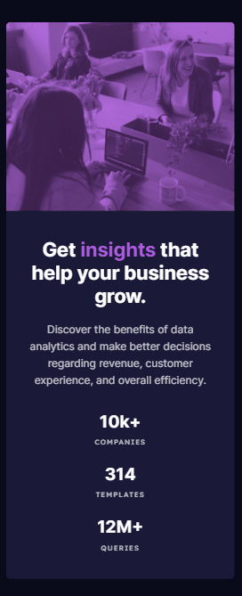

# Frontend Mentor - Stats preview card component solution

This is a solution to the [Stats preview card component challenge on Frontend Mentor](https://www.frontendmentor.io/challenges/stats-preview-card-component-8JqbgoU62). Frontend Mentor challenges help you improve your coding skills by building realistic projects. 

## Table of contents

- [Overview](#overview)
  - [The challenge](#the-challenge)
  - [Screenshot](#screenshot)
  - [Links](#links)
- [My process](#my-process)
  - [Built with](#built-with)
  - [What I learned](#what-i-learned)
  - [Continued development](#continued-development)
- [Author](#author)

## Overview

Hello everyone, I'm excited to share my solution to the Stats preview card component challenge from Front-end mentor. 

### The challenge

Users should be able to:

- View the optimal layout depending on their device's screen size

### Screenshot

### Links

- Solution URL: [solution](https://github.com/HosseinHeydarpour/stats-preview-card-component)
- Live Site URL: [Live site](https://hosseinheydarpour.github.io/stats-preview-card-component/)

## My process

I used SASS and BEM methodology together to create a cleaner and more organized codebase. Flex-box was used for the overall layout.

### Built with

- Semantic HTML5 markup
- CSS custom properties
- Flexbox
- SASS
- Desktop-first workflow
- BEM methodology

### What I learned

In this project i worked with CSS blend mode for creating the layer on the image. 

### Continued development

I am planning to use Tailwind CSS in my next projects :)

## Author

- Frontend Mentor - [@HosseinHeydarpour](https://www.frontendmentor.io/profile/HosseinHeydarpour)
- Linkedin - [@hosseinheydarpour](www.linkedin.com/in/hosseinheydarpour)

